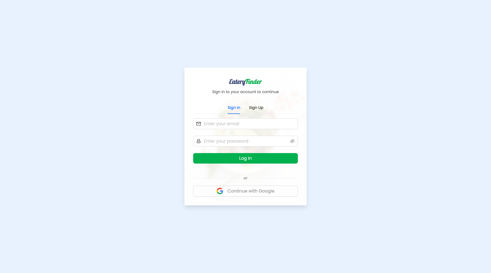
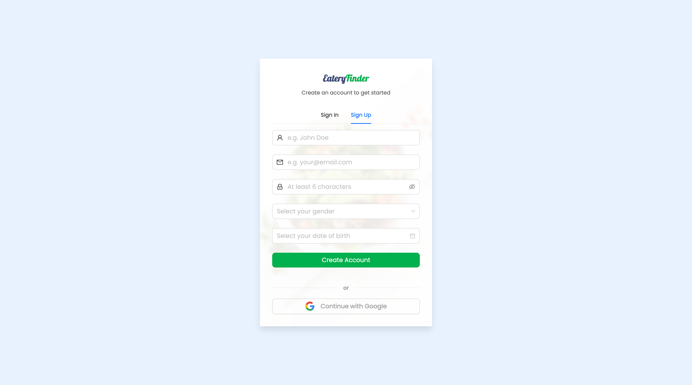
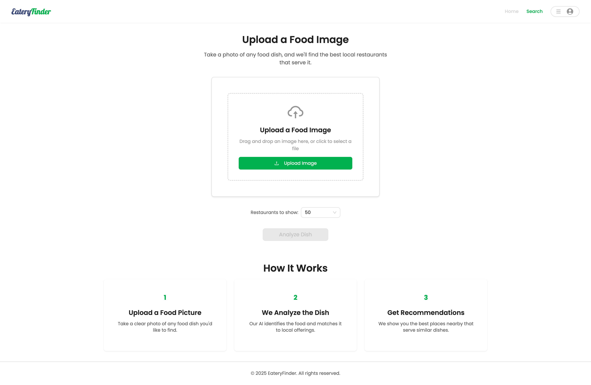
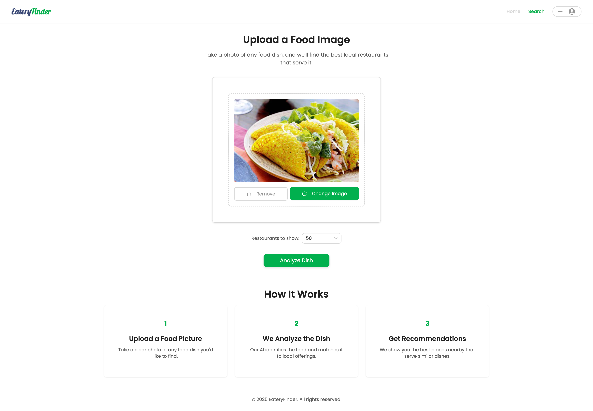
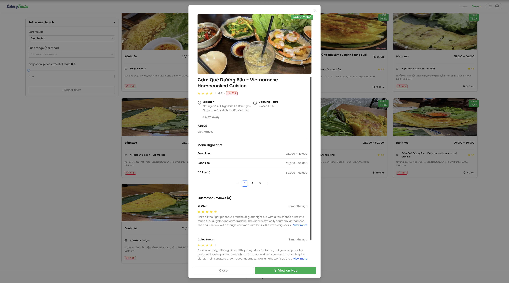
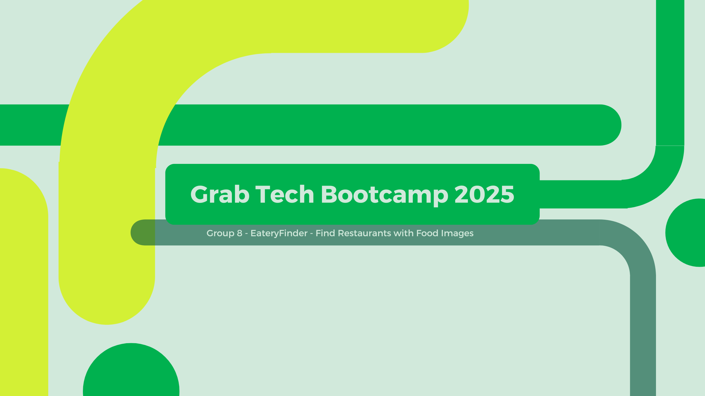

# Grab Bootcamp Frontend Project

This project is a modern frontend application built with React and Vite, designed to help users find restaurants by uploading a food image. It leverages image analysis to identify dishes and provides relevant restaurant information, including menus and reviews.

## Table of Contents

- [Features](#features)
- [Technologies Used](#technologies-used)
- [Getting Started](#getting-started)
  - [Prerequisites](#prerequisites)
  - [Installation](#installation)
  - [Running the Project](#running-the-project)
  - [Building the Project](#building-the-project)
  - [Linting and Formatting](#linting-and-formatting)
- [Project Structure](#project-structure)
- [UI Screenshots](#ui-screenshots)
- [Demo Video](#-demo-video)
- [Contributing](#contributing)
- [License](#license)

## Features

- **Image-based Restaurant Search:** Upload a food image to find restaurants serving that dish.
- **Restaurant Details:** View detailed information about restaurants, including menu items, reviews, and location.
- **User Authentication:** Secure sign-up and sign-in functionality.
- **Responsive Design:** Optimized for various screen sizes using Emotion for styling.
- **State Management:** Utilizes Redux Toolkit for efficient state management.
- **Modern UI:** Built with Ant Design components for a clean and professional look.

## Technologies Used

- **React:** A JavaScript library for building user interfaces.
- **Vite:** A fast build tool for modern web projects.
- **TypeScript:** A typed superset of JavaScript that compiles to plain JavaScript.
- **Ant Design:** A popular React UI library.
- **Emotion:** A library for writing CSS with JavaScript.
- **Redux Toolkit:** The standard way to write Redux logic.
- **React Router DOM:** For declarative routing in React applications.
- **Axios:** A promise-based HTTP client.
- **Dayjs:** A minimalist JavaScript library for parsing, validating, manipulating, and formatting dates.
- **React Hook Form:** For flexible and extensible forms with easy validation.
- **Polished:** A lightweight style helper library for writing styles in JavaScript.

## Getting Started

Follow these instructions to get the project up and running on your local machine for development and testing purposes.

### Prerequisites

- Node.js (version recommended by the project or latest LTS)
- npm or yarn package manager

### Installation

1. Clone the repository:
   ```bash
   git clone https://github.com/thvnhtai/grab-bootcamp-frontend.git
   cd grab-bootcamp-frontend
   ```
2. Install the dependencies using yarn or npm:
   ```bash
   yarn install
   ```
   or
   ```bash
   npm install
   ```

### Running the Project

To start the development server:

```bash
yarn dev
```

or

```bash
npm run dev
```

Open your browser and navigate to `http://localhost:5173` (or the port indicated in your terminal).

### Building the Project

To build the project for production:

```bash
yarn build
```

or

```bash
npm run build
```

This will generate the production-ready files in the `dist` directory.

### Linting and Formatting

To check for linting errors:

```bash
yarn lint
```

or

```bash
npm run lint
```

To check code formatting:

```bash
yarn prettier
```

or

```bash
npm run prettier
```

To automatically fix formatting issues:

```bash
yarn prettier:fix
```

or

```bash
npm run prettier:fix
```

## Project Structure

The project follows a standard React application structure:

```
grab-bootcamp-frontend/
├── public/
├── src/
│   ├── assets/
│   ├── components/       # Reusable UI components
│   │   ├── common/
│   │   ├── forms/
│   │   ├── layout/
│   │   ├── restaurant/
│   │   ├── static/
│   │   └── utility/
│   ├── constants/      # Application constants
│   ├── enums/          # Enums
│   ├── hooks/          # Custom React hooks
│   ├── layouts/        # Page layouts
│   ├── pages/          # Application pages
│   │   ├── auth/
│   │   ├── home/
│   │   ├── search/
│   │   └── search-result/
│   ├── providers/      # Context and state providers
│   ├── redux/          # Redux store and slices
│   ├── services/       # API service calls
│   ├── types/          # TypeScript type definitions
│   ├── utils/          # Utility functions
│   ├── App.tsx         # Main application component
│   ├── index.css       # Global styles
│   └── main.tsx        # Entry point
├── .eslintrc.js        # ESLint configuration
├── .gitignore          # Git ignore file
├── .prettierrc         # Prettier configuration
├── index.html          # HTML entry file
├── package.json        # Project dependencies and scripts
├── tsconfig.json       # TypeScript configuration
├── tsconfig.app.json
├── tsconfig.node.json
└── vite.config.ts      # Vite configuration
```

## UI Screenshots

Here are some preview screenshots of the Grab Bootcamp Frontend in action:

### 🔍 Sign In Page



### 🔍 Sign Up Page



### 🔍 Home Page


### 📸 Image Upload and Search




### 🍽️ Search Results Page


### 🏪 Restaurant Details Page



## 🎥 Demo Video

Check out the full demo here: [Watch on YouTube](https://youtu.be/V_TiwK4_2l0)

[](https://youtu.be/V_TiwK4_2l0)

## Contributing

Contributions are welcome! Please follow these steps:

1. Fork the repository.
2. Create a new branch (`git checkout -b feature/your-feature-name`).
3. Make your changes.
4. Commit your changes (`git commit -m 'feat: Add new feature'`).
5. Push to the branch (`git push origin feature/your-feature-name`).
6. Create a new Pull Request.

Please ensure your code adheres to the project's linting and formatting standards.

## License

This project is licensed under the MIT License - see the [LICENSE](LICENSE) file for details.
